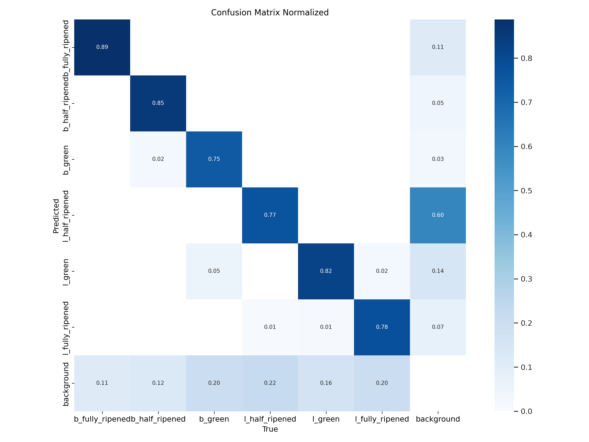
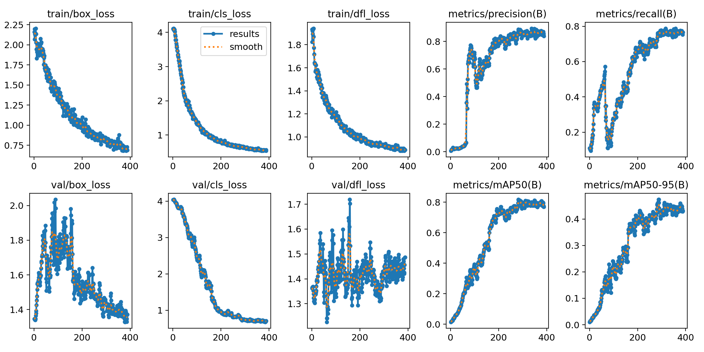

# rainbow_yu 🐋✨
##  计算机视觉难点实验汇总

---


---

# cv_mnist(exp4)

本实验仅使用单个 Jupyter Notebook 完成 ，无需多个 `.py` 文件。

## 对老师代码的修正与优化

在原始代码的基础上进行了以下改进：

1. **文本修正**：
   - 修正了大小变量写不匹配问题。
   - 修正了中文标点符号，替换为英文标点。

2. **数据加载调整**：
   - 由于 MNIST 数据集为 `.gz` 格式，对 `load_labels` 和 `load_images` 函数进行了修改，加入了 gzip 支持。

3. **Qt 优化**：
   - 在 Qt 中加入了进程检测，避免了重复初始化进程。
   - 添加了一个 `uint8` -> `str` 的强制类型转换，防止输出错误。

4. **文件存在性检测**：
   - 增加了文件检测机制，避免已训练模型的重复训练。

## 依赖库的安装

   - 切换到文件目录 `cd ./cv_exp4`
   - 一键安装依赖 `pip install -r requirements.txt`
   - 记得改自己的文件路径

---

# cv_cnn(exp5)
计算机视觉实验5

## 单文档一键化实验操作，分步调试实现  

- 这个相当于是计算机视觉中比较基础的操作。如果想体验更完整的功能，可以参考 YOLO 的文档；本实验较为基础，按照 README 文档一步步调试即可。  
- YOLO 详细参考 [Ultralytics](https://github.com/ultralytics/yolov5)。  
- 这个文件中的文件路径只需填写根目录，服务器远程模型时也不用担心一直调试问题
- 服务器中几乎不需要设置断点，设置模式自动断点

> **注意**：模型在 CPU 上运行时间较长。如果没有服务器租赁经验，这里直接提供模型，在 `./saved_models` 中，但准确率较低（batch size=32, epoch=5, acc=0.91），供大家随意使用。  

---

## 相较于老师版本的改进和修正  

1. **分步实现**：清晰化文件分支，单文档实现。  
2. **更新 GPU 检测代码**：自动检测是否支持 GPU 运算。  
3. **添加自动分类的 JSON 函数**：便于生成分类文件。  
4. **添加数据集的自动划分代码**：支持数据集自动划分为训练集和验证集。  
5. **修正 classes 分支的列表层数**：确保数据格式正确。  
6. **删除模型训练的延迟参数**：优化模型训练过程。  
7. **改进 reload 弃用函数**：避免调用已弃用的 API。  

---

## 详细使用方法  

1. 安装依赖：
   > 直接requirements里的依赖
   ```bash
   pip install -r requirements.txt
   ```

   > 加入依赖时有什么数据包不成功，建议新建一个conda环境
   ```bash
   conda create -n [env-name] [python-version]
   conda activate [env-name]
   pip install -r requirements.txt
   ```
   
3. 注意事项：
- 根据实际情况调整 CUDA 和 cuDNN 的版本。
- 分步操作时，需要调整 mode 参数以及文件路径

3. 模式选择：
   
   | 模式编号  | 模式名称          |
   |-----------|-------------------|
   | 0         | 一键化操作        |
   | 1         | 分类已生成        |
   | 2         | 完成数据集划分    |
   | 3         | 分步可视化        |
   | 4         | 完成模型训练      |
   | 5         | 完成预测          |


## 大致最终文件结构
cv_cnn  
├── evaluate  
├── Plant_leave_diseases_dataset_with_augmentation  
├── saved_models  
├── train  
├── val  
├── categories.json  
├── cv_exp5.ipynb  

---

# cv_rcnn(exp6)
计算机视觉实验6

## 数据预处理
- `ipynb` 文件中主要将原来tomato的数据集变为仿coco数据集格式和VOC数据集格式

## RCNN模型
- 书写了基础的RCNN网络架构，但只是用eval进行评估，可进行后续可视化和训练操作

## YOLO完成第二个网络
- 这个相当于是计算机视觉中比较基础的操作。如果想体验更完整的功能，可以参考 YOLO 的文档； 
- YOLO 详细参考 [Ultralytics](https://github.com/ultralytics/yolov5)。
- 模型的一些性能和参数如图



> **注意**：模型在 CPU 上运行时间较长。如果没有服务器租赁经验，这里直接提供模型，在 `./model` 中，使用A800完成训练，预计500轮，在400轮左右早停，供大家随意使用。  

---

## 详细使用方法  

1. 安装依赖：

   ```bash
   pip install -r requirements.txt
   ```
   
2. 注意事项：
- 根据实际情况调整 pytorch 的版本。
- 需要原始的数据集，并且按数据集生成代码中的文件路径进行配置和生成合适的数据集


## 大致最终文件结构
cv_rcnn   
├── model   
├── datasets    
├── cv_exp6.ipynb 